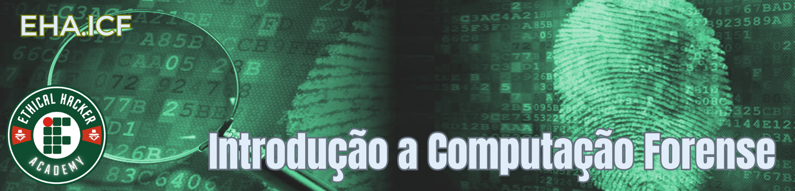

???+ note "Informações Gerais sobre o Curso:"

    * **Curso:** 0014.CN - Introdução a Computação Forense
    * **Modalidade:** À Distância (EaD)
    * **Ato Normativo:** Portaria 83/2018 - DG/CN/RE/IFRN
    * **Carga-Horária:** 60h (80 aulas)
    * **Turma em Andamento:** Aguardando início (previsão: junho/2025)
    * **Professor:** Ricardo Kléber