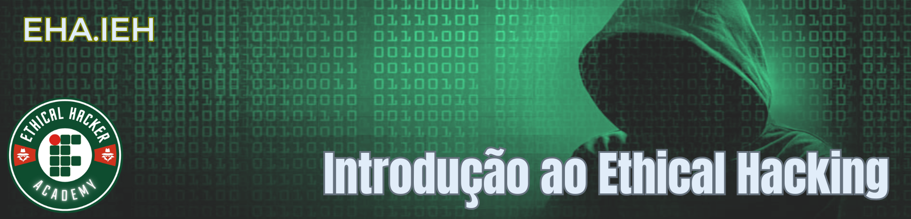
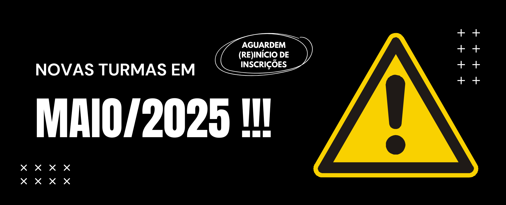

??? abstract "Apresentação do Curso"
    

        <iframe src="https://docs.google.com/presentation/d/e/2PACX-1vTBNjUqtbfZxP04kZPBfqsQP0irI7fz8_g8BqfX7CnOKhyfir2XWVfGm0WjRv5Vq8mhbn7dxW_gpgGf/pubembed?start=false&loop=false&delayms=3000" frameborder="0" width="1058" height="440" allowfullscreen="true" mozallowfullscreen="true" webkitallowfullscreen="true"></iframe>
    

???+ note "Informações Gerais sobre o Curso:"

    * **Curso:** 0010.CN - Introdução ao Ethical Hacking
    * **Modalidade:** À Distância (EaD)
    * **Ato Normativo:** Portaria 85/2018 - DG/CN/RE/IFRN
    * **Carga-Horária:** 60h (80 aulas)
    * **Turma em Andamento:** Aguardando início (previsão: maio/2025)
    * **Professor:** Ricardo Kléber

??? note "Informações Específicas:"

    **Objetivos do curso**

    O curso FIC em Introdução ao Ethical Hacking, na modalidade à distância, tem como objetivo geral proporcionar aos egressos capacitação teórica e prática sobre conceitos e técnicas relacionadas a exploração de vulnerabilidades de segurança em sistemas computacionais de forma ética e controlada, dotando-os de conhecimentos complementares à formação tradicional em cursos de computação para atuação no marcado de trabalho na área de segurança da informação servindo, ainda, como base para cursos avançados complementares oferecidos pela instituição.

    **Público-alvo**

    O curso FIC em Introdução ao Ethical Hacking visa desenvolver competências e habilidades necessárias aos que desejam atuar na área de segurança da informação de forma ética tendo como público-alvo, portanto, todos os estudantes, profissionais e curiosos da área de computação que desejam conhecer e/ou ampliar seus conhecimentos nessa área do conhecimento. 

    **Requisitos e formas de acesso**

    Embora seja destinado a praticamente todos os interessados da área de computação, o curso FIC em Introdução ao Hacking Ético apresenta como requisito mínimo de escolaridade o ensino médio (completo ou em curso), além de ser recomendável – porém não imprescindível – o conhecimento intermediário em redes de computadores e no sistema operacional Linux. 
    As habilidades mínimas requeridas são avaliadas através da submissão de interessados ao 'Módulo de Acesso' disponível ininterruptamente a partir do website do projeto, onde o interessado deve preencher formulário de interesse e, após credenciado, se submeter à avaliação do módulo para demonstrar os requisitos mínimos para a participação neste e nos demais cursos da academia. 
    O curso também pode ser ofertado por demanda, ou seja, na medida em que for solicitado por outros campi do IFRN, assim como por outras instituições, de acordo com os termos de cooperação técnica realizados com o Câmpus Currais Novos.

    **Avaliação do processo de ensino e aprendizagem**

    A avaliação será contínua contabilizada a partir da realização das atividades propostas na plataforma. 
    O envio das atividades solicitadas deverá ser feito exclusivamente pela plataforma AVA. 
    Não serão recebidas atividades por quaisquer outros meios. 
    As atividades objetivas serão corrigidas automaticamente na plataforma e as subjetivas serão corrigidas pelo professor com nota e feedback disponibilizados na plataforma para esclarecimentos dos critérios adotados para atribuição da nota.
    Um dos critérios adotados é o cumprimento dos prazos estabelecidos para o envio das atividades propostas, visto que isto é fundamental para o sucesso dos cursos ofertados a distância. 
    Os alunos serão submetidos a atividades avaliativas – utilizando o ambiente virtual de aprendizagem (AVA) – baseadas em questões teóricas sobre o conteúdo ministrado e questões práticas de laboratório com o objetivo de avaliar a capacidade de resolução de problemas dentro do escopo do curso. 
    O rendimento final do aluno será avaliado através da média das notas aferidas nas atividades avaliativas.
    **Para ser considerado aprovado** o estudante deve obter pelo menos a **pontuação mínima (média do IFRN) de 60 pontos na nota final (NF)**.

    **Metodologia de participação nas atividades do curso**

    Para participar ativamente do curso, o aluno deve ter disponível computador ligado à Internet, de preferência com banda larga e qualquer sistema operacional (preferencialmente o sistema operacional Linux, porém, caso prefira, o aluno poderá usar as ferramentas em ambiente virtualizado ou na forma de contêineres). 
    Caso não disponha de equipamento adequado, e resida na área de abrangência do câmpus, o aluno pode recorrer a um dos laboratórios de informática do Câmpus Currais Novos. 
    O Curso utilizará a plataforma Moodle (ambiente virtual de aprendizagem) como principal meio de disponibilização de material e avaliação do curso e funcionará no modelo **autoinstrucional** (sem tutor/monitor), tendo o aluno a responsabilidade de se apropriar de todas as orientações necessárias para a participação no curso disponibilizadas na página do projeto e/ou no ambiente Moodle. 
    O conteúdo dos tópicos da disciplina está sistematizado em diferentes formatos a seguir especificados:

    - Videoaulas;
    - Livros Eletrônicos com acesso Online (E-Books);
    - Textos em formato eletrônico (.pdf);
    - Links externos para complementar os conteúdos;
    - Bibliografia complementar sugerida no PPC e nos ambientes do curso.

??? note "Estrutura Curricular do Curso:"

    1. Fundamentos e metodologia do Hacking Ético (12h/a)
        1. Principais conceitos relacionados a Ethical Hacking
        2. Aspectos legais
        3. Mercado de trabalho e certificações na área
        4. Testes de Intrusão (Penetrations Tests)
        5. Fases de um Teste de Intrusão
        6. Documentação: Sumário Executivo e Laudo Técnico
    2. Preparação do ambiente de testes (16h/a)
        1. Instalação e configuração de máquinas virtuais
        2. Visão geral e principais ferramentas do Kali Linux
        3. Visão geral do Metasploitable
    3. Fundamentos de redes de computadores e sistemas Linux (12h/a)
        1. Visão geral da arquitetura TCP/IP
        2. Visão geral do sistema operacional Linux
        3. Principais comandos e ferramentas Linux para uso no curso
    4. Reconhecimento/análise de alvos (Footprinting) (12h/a)
        1. Levantamento não intrusivo de informações
        2. Consultas baseadas em informações de domínio
        3. Consultas baseadas na técnica Google Hacking
    5. Varreduras (scanning) (12h/a)
        1. Buscas por hosts, portas e serviços
        2. Funções básicas da ferramenta Nmap
        3. Enumeração: Identificação de sistemas e vulnerabilidades
        4. Scanning de Vulnerabilidades
        5. Funções avançadas da ferramenta Nmap
    6. Exploração de vulnerabilidades (fase de ataque) (16h/a)
        1. Ataques de força bruta externos
        2. Ataques de força bruta internos
        3. Exploranção de vulnerabilidades com Metasploit

- <a href="../assets/arquivos/Introdução_ao_Ethical_Hacking_na_modalidade_à_distância.pdf" target="_blank">PPC do Curso (Aprovado pelo Colegiado da DIAC/CN) [Donwload]</a>

