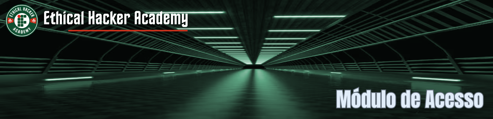

---
hide:
  - toc
---

Todos os cursos da EHA/IFRN presumem um **conhecimento prévio (introdutório)** nas áreas de:

* Redes de Computadores
* Sistema Operacional Linux
* Contêineres (Docker)
* Máquinas Virtuais (VirtualBox)

Como os cursos EaD da academia são autoinstrucionais (não têm tutoria/suporte para a fixação dos conceitos e execução das atividades), **sem esses conhecimentos o aluno poderá ter dificuldades de seguir em frente**.

Por isso, para a inscrição nos cursos é necessário, antes, **comprovar essas habilidades** sendo aprovado no **Módulo de Acesso** com **média igual ou superior a 70%**.

Se você não tem, ainda, um conhecimento básico nessas áreas, disponibilizaremos aqui material para estudo e **sugerimos fortemente que não se submetam à avaliação do Módulo de Acesso sem essas competências introdutórias**.

A avaliação do Módulo de Acesso é composta de **30 (trinta) questões objetivas de múltipla escolha** (4 alternativas, sendo, apenas uma correta) contemplando:

- Redes de Computadores [10 questões]
- Sistema Operacional Linux [10 questões]
- Contêineres (Docker) [5 questões]
- Máquinas Virtuais (VirtualBox) [5 questões]

Para a realização da avaliação o interessado terá **45 (quarenta e cinco) minutos**, contabilizados automaticamente pela plataforma e indicados em um cronômetro no próprio ambiente. Ao final do tempo, caso o interessado não tenha ainda finalizado o questionário e submetido suas respostas, as respostas serão enviadas automaticamente, e a avaliação será finalizada.

O interessado saberá sua nota na avaliação imediatamente após a realização.

**Se já está preparado, preencha o formulário logo mais abaixo** para o seu cadastramento na plataforma e inscrição no módulo de acesso e aguarde a mensagem de confirmação (ou orientações complementares) atrvés do e-mail informado no formulário.

IMPORTANTE:

1. Após a conferência dos dados, você receberá um e-mail com as credenciais para acesso ao nosso Ambiente EaD e terá até 30 (trinta) dias para realizar a avaliação do Módulo de Acesso;
2. Caso o interessado não acesse a plataforma e/ou não realize a avaliação do Módulo de Acesso até 30 dias após receber as credenciais, seu acesso à plataforma será bloqueado;
3. Se o interessado não for aprovado no Módulo de Acesso (obtiver média inferior a 70%) poderá realizar nova tentativa 7 (sete) dias após a realização da avaliação.
4. Tanto o procedimento de cadastramento no Ambiente EaD, como o envio do e-mail de confirmação com as credenciais e, ainda, após a aprovação no Módulo de Acesso, o envio das orientações para inscrição nos cursos é feito de forma manual. Aguarde o retorno da coordenação/secretaria. Em caso de dúvidas envie mensagem para: ehaifrn@gmail.com.

???+ abstract "Formulário para Cadastramento no Módulo de Acesso"
    

      <iframe src="https://docs.google.com/forms/d/e/1FAIpQLSdDh-akznaEjdXRO7zic99LzCs6JlH986WtakLWAF3zRrJabg/viewform?embedded=true" width="1024" height="1024" frameborder="0" marginheight="0" marginwidth="0">Carregando…</iframe>
    
