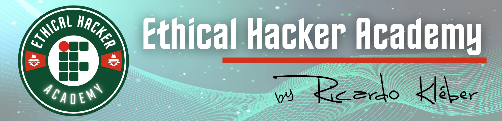

---
hide:
  - toc
---

Criado em 2013, tendo como slogan "Hacking com Responsabilidade", o projeto de Extensão "Ethical Hacker Academy" do IFRN, surgiu como uma iniciativa para capacitar profissionais da área de informática a atuar em atividades de análise (autorizada) de segurança de sistemas computacionais, seguindo as metodologias adotadas pelas principais normas e certificações internacionais na área de "Hacking Ético".

O projeto inicial era oferecer cursos presenciais para alunos do IFRN Campus Natal Central, mas com o surgimento da demanda externa, passou a oferecer turmas para o público externo à instituição (profissionais da área), além de prestar consultoria esporádica a órgãos públicos e da iniciativa privada.

O projeto passou então a utilizar-se de ferramentas EaD (AVA, videoaulas e sistemas de videoconferência) com o objetivo de atender a demandas da própria instituição (em seus diversos campi espalhados pelo Estado), principalmente com a transferência do seu coordenador para o campus Currais Novos.

Em 2017 a EHA/IFRN foi reformulada passando a contar, também, com desafios periódicos de CTF (Capture The Flag) estimulando a curiosidade de alunos de todos os níveis (ensino médio e graduação principalmente) e planejando a oferta de novos cursos de formação inicial e continuada (FIC), com a intenção de, gradativamente, ofertar o primeiro curso de pós-graduação do IFRN na área de segurança da informação do IFRN.

O projeto esteve suspenso por tempo indeterminado por questões pessoais e profissionais de seu coordenador, mas finalmente está de volta em 2025 reiniciando seus trabalhos, buscando atingir seus objetivos.